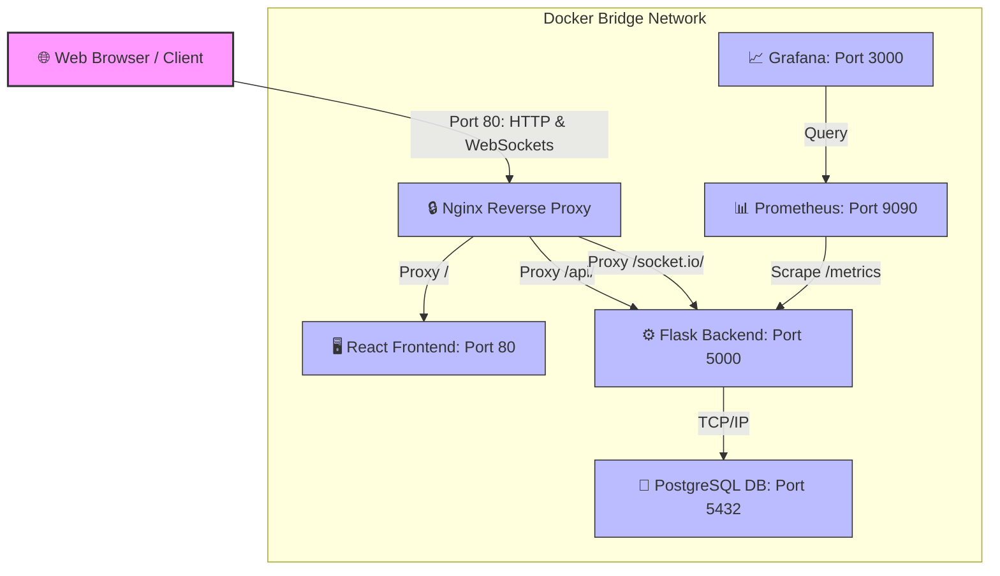

# 📊 Smart Queue Manager

[](https://github.com/prakash200627/smart-queue-manager/actions/workflows/backend-ci.yml)
[](https://github.com/prakash200627/smart-queue-manager/actions/workflows/frontend-ci.yml)
[](https://github.com/prakash200627/smart-queue-manager/actions/workflows/docker-ci.yml)
[](https://github.com/prakash200627/smart-queue-manager/actions/workflows/deploy.yml)
[](https://opensource.org/licenses/MIT)

**Smart Queue Manager** is an enterprise-grade, real-time queue and token management application designed to optimize counter operations and minimize customer wait times. It features an intelligent backend utilizing Machine Learning to estimate service categories and predict wait times, coupled with a dynamic Reinforcement Learning (Q-learning) optimizer that routes customers to the most efficient counter. 

Built with scalability and resilience in mind, the project employs a modern microservices architecture containerized with **Docker**, choreographed via **Docker Compose**, proxied securely through **Nginx**, monitored with **Prometheus & Grafana**, and deployed continuously on **AWS EC2** using **GitHub Actions**.

---

## 🗺️ System Architecture

The application is deployed as an isolated microservices stack inside a private Docker bridge network. Nginx serves as the unified ingress gateway, directing traffic based on routing rules and protocol upgrades.



### 🔀 Nginx Reverse Proxy Routing Mechanics
* **Frontend Routing (`/`)**: Static React application assets served via a lightweight Nginx web server running inside the `sqm-frontend` container.
* **API Routing (`/api/*`)**: Requests are forwarded to the Gunicorn-powered Flask server. The `/api/` prefix is stripped during proxying (`proxy_pass http://backend:5000/;` with a trailing slash) so the Flask application handles routes natively (e.g., `/queue/new` instead of `/api/queue/new`).
* **Real-time Communication (`/socket.io/*`)**: Active WebSocket connections are routed directly to the SocketIO backend. Nginx is configured to support HTTP/1.1 protocol upgrades, maintaining persistent, low-latency connections:
  ```nginx
  proxy_http_version 1.1;
  proxy_set_header Upgrade $http_upgrade;
  proxy_set_header Connection "Upgrade";
  ```
* **Network Isolation**: Only Nginx exposes external ports (`80:80` and `443:443`). Frontend and backend containers only expose ports internally within the Docker bridge network. This prevents direct external exposure of raw backend endpoints.

---

## ✨ Features

- **Queue Management Engine**: Complete lifecycle tracking of tokens (`waiting` ➡️ `serving` ➡️ `completed`).
- **Real-Time Synchronisation**: Direct Socket.IO integration updates the digital queue board and counters across all client instances instantly.
- **Embedded AI waiting estimator**: Estimates wait times based on historical counter throughput and schedules routing dynamically using a Q-learning reinforcement learning agent.
- **Multi-Container Orchestration**: Production-grade `docker-compose` setup with persistent volumes for database and monitoring data.
- **Prometheus Observability**: Preconfigured metrics endpoint exposing database health, WebSocket connections, and queue lengths.
- **Grafana Visualization**: Provisioned interactive dashboard displaying real-time telemetry.
- **Resilient Deployment**: Configured with kernel-level Swap Memory allocations to prevent out-of-memory (OOM) failures on low-resource cloud hosts.
- **Robust CI/CD Pipelines**: Automatic build verification, unit testing, and zero-downtime deployment to AWS EC2 via GitHub Actions.

---

## 🛠️ Tech Stack

| Component | Technology | Version / Specifics |
|---|---|---|
| **Frontend** | React, Vite, Axios, Socket.io-client | React 19+, Vite 7+ |
| **Backend** | Python Flask, Flask-SocketIO, Gunicorn, Eventlet | Flask 3.1.3, Eventlet worker |
| **Database** | PostgreSQL | Version 15 (Dockerized) |
| **Orchestration**| Docker, Docker Compose | Bridge Network, Isolated ports |
| **Ingress** | Nginx | Alpine-based gateway proxy |
| **Monitoring** | Prometheus, Grafana | Custom instrumentation, dynamic dashboard |
| **CI/CD** | GitHub Actions | Multiphase automated pipeline |
| **Cloud Hosting**| AWS EC2 | Ubuntu 22.04 LTS |

---

## 🚀 Installation & Local Development

### Prerequisites
* **Python 3.11+**
* **Node.js 18+**
* **PostgreSQL 15+** (Optional, falls back to SQLite in local development mode)

### 1. Run the Backend locally
Navigate to the backend directory, configure dependencies, and start the application:
```bash
# Navigate to backend
cd backend

# Create and activate virtual environment
python -m venv venv
# On Windows:
.\venv\Scripts\activate
# On macOS/Linux:
source venv/bin/activate

# Install dependencies
pip install -r requirements-dev.txt

# Create environment configuration
cp .env.example .env
# Edit backend/.env to customize configurations if necessary

# Start Flask development server
python run.py
```
*The local backend API will be accessible at `http://localhost:5000`.*

### 2. Run the Frontend locally
Open a new terminal window, navigate to the frontend directory, and run the Vite dev server:
```bash
# Navigate to frontend
cd frontend

# Install packages
npm install

# Create environment configuration
cp .env.example .env

# Run Vite dev server
npm run dev
```
*The React application will launch at `http://localhost:5173`.*

---

## 🐳 Docker Compose Deployment (Local & Staging)

To deploy the entire multi-container architecture in a production-like environment on your local machine:

1. **Verify or adjust environment files**:
   Ensure `backend/.env` is configured properly. By default, the `DATABASE_URL` should point to the PostgreSQL service inside the Docker network:
   ```env
   DATABASE_URL=postgresql://postgres:postgres@db:5432/smartqueue
   ```

2. **Launch the Docker Compose Stack**:
   From the repository root, execute:
   ```bash
   docker compose up -d --build
   ```

3. **Check Container Statuses**:
   ```bash
   docker compose ps
   ```
   You should see all containers (`sqm-db`, `sqm-backend`, `sqm-frontend`, `sqm-nginx`, `sqm-prometheus`, `sqm-grafana`) up and running.

4. **Verify Application Gateways**:
   * **Web App (Nginx Proxy)**: `http://localhost`
   * **Prometheus Dashboard**: `http://localhost:9090`
   * **Grafana Dashboard**: `http://localhost:3001`
   * **Backend Metrics Endpoint**: `http://localhost:5000/metrics`

---

## ☁️ AWS EC2 Deployment Guide

Deploying this architecture to an AWS EC2 instance requires setting up the machine, adjusting ingress security groups, configuring virtual memory to avoid resource starvation, and launching the docker containers.

### Step 1: Launch and Configure the EC2 Instance
1. Launch an EC2 Instance (e.g., `t2.micro` or `t3.micro` running **Ubuntu Server 22.04 LTS**).
2. Configure the **Security Group** with the following inbound rules:
   * **Port 22**: SSH access (restricted to your IP).
   * **Port 80**: HTTP access (open to 0.0.0.0/0).
   * **Port 443**: HTTPS access (open to 0.0.0.0/0).
   * **Ports 9090 & 3001**: Optional, only if you want to expose Prometheus/Grafana interfaces directly to the internet (recommended to access via SSH tunnels instead).

### Step 2: Set Up Swap Memory (OOM Prevention)
On micro instances with 1GB RAM, memory spikes during machine learning model retraining or massive WebSocket broadcast storms can cause the Linux kernel Out-Of-Memory (OOM) killer to terminate the Flask container. Allocate **2GB of swap space** to prevent crashes:
```bash
# Connect to your EC2 instance
ssh -i "your-key.pem" ubuntu@YOUR_EC2_PUBLIC_IP

# Create a 2GB swap file
sudo fallocate -l 2G /swapfile

# Set the correct permissions (read/write only by root)
sudo chmod 600 /swapfile

# Format the file as swap space
sudo mkswap /swapfile

# Enable swap memory
sudo swapon /swapfile

# Confirm the swap is active
sudo swapon --show
free -h

# Make swap persistent across reboots
echo '/swapfile none swap sw 0 0' | sudo tee -a /etc/fstab
```

### Step 3: Install Docker and Docker Compose
```bash
# Update local packages
sudo apt update && sudo apt upgrade -y

# Install Docker
sudo apt install -y docker.io

# Enable and start Docker service
sudo systemctl enable docker
sudo systemctl start docker

# Add your user to the docker group
sudo usermod -aG docker $USER

# Log out and log back in to apply group changes
exit
ssh -i "your-key.pem" ubuntu@YOUR_EC2_PUBLIC_IP

# Verify docker compose is installed
docker compose version
```

### Step 4: Clone and Spin Up the Stack
```bash
# Clone the repository
git clone https://github.com/prakash200627/smart-queue-manager.git
cd smart-queue-manager

# Configure env files
cp backend/.env.example backend/.env
# Edit using nano or vim to set secure production keys
nano backend/.env

# Start application stack
docker compose up -d --build
```
Your application is now active at `http://YOUR_EC2_PUBLIC_IP`.

---

## 📊 Observability & Monitoring

The system exposes deep performance telemetry through a custom-built Prometheus-Grafana stack.

### 🔌 Prometheus Instrumentation
Backend metrics are exposed via a `/metrics` route on the Flask container.

> [!IMPORTANT]
> **Resolution of the `/metrics` 404 Issue in Debug Mode**:
> In Flask development mode, the Werkzeug auto-reloader runs the application twice. By default, `prometheus-flask-exporter` disables `/metrics` on reloaded subprocesses to prevent port conflicts, resulting in 404 responses. 
> To resolve this, the environment variable `DEBUG_METRICS` is programmatically set to `1` inside `backend/app/__init__.py` before the metric engine initializes, ensuring consistent metric scraping across development and production runs.

### 📋 Custom Metrics Table
We export custom application Gauges from `backend/app/monitoring.py` to evaluate the real-time queue states dynamically:

| Metric Name | Type | Description | Evaluation Logic |
|---|---|---|---|
| `smartqueue_queue_length` | Gauge | Current number of waiting tokens | Dynamic query counting database records with `status='waiting'` |
| `smartqueue_websocket_connections` | Gauge | Current active socket connections | Measures active Socket.IO connections in the Eventlet instance |
| `smartqueue_backend_health` | Gauge | Backend database connectivity status | Executes a fast `SELECT 1` query. Returns `1` (healthy) or `0` (unhealthy) |

### 📈 Grafana Dashboards
Grafana is pre-wired to scrape the local Prometheus instance. Key visual panels implemented:
1. **Backend Health**: Binary indicator representing database reachability.
2. **Queue Length**: Time-series graph demonstrating token accumulation trends.
3. **Active WebSockets**: Live monitoring of real-time client connection count.
4. **Scrape Target Status**: Up/down telemetry showing Prometheus connection integrity to `backend:5000`.

---

## 🔁 CI/CD Workflows

Continuous Integration and Deployment are automated via GitHub Actions, validating structural stability and code hygiene before deployment.

```
[Developer Push] 
       │
       ├───► [Backend CI]: Python Setup ──► Install deps ──► Run Pytest
       ├───► [Frontend CI]: Node Setup ───► Install deps ──► Vite Build
       ├───► [Docker CI]: Compose Setup ──► Validate container builds
       │
   (Merge to main)
       │
       ▼
[EC2 CD Workflow]: SSH Tunnel ──► Git Pull ──► Docker Rebuild ──► Zero-Downtime Swap
```

### GitHub Actions Workflows Configured:
1. **Backend CI (`backend-ci.yml`)**:
   Runs on pull requests and pushes to `main`. Sets up Python 3.11, installs dev dependencies from `requirements-dev.txt`, and executes the Pytest suite.
2. **Frontend CI (`frontend-ci.yml`)**:
   Validates React code building and packaging. Sets up Node 18, executes `npm ci`, and verifies build validity using `npm run build`.
3. **Docker Validation (`docker-ci.yml`)**:
   Orchestrates local container build verification. Automatically executes a mock build of the `docker-compose.yml` stack to ensure Dockerfiles build cleanly.
4. **Continuous Deployment (`deploy.yml`)**:
   On every merge to `main`, this workflow connects to the EC2 host via SSH, pulls the latest changes, runs tests, and runs a zero-downtime rebuild (`docker compose up -d --build`).

---

## 📸 Screenshots

Below are placeholders representing the monitoring suite and user interfaces. 

| **Service Board Interface** | **Admin Control Panel** |
|:---:|:---:|
|  |  |
| *Live queue dashboard displaying active tickets and real-time counter changes.* | *Admin interface allowing counters to process tickets, toggle status, and see AI details.* |

| **Prometheus Targets Status** | **Grafana Observability Dashboard** |
|:---:|:---:|
|  |  |
| *Status view confirming backend targets are in the active 'UP' state.* | *Real-time visualization panels showing active WebSockets and Database connections.* |

---

## 🔮 Future Improvements

- **Redis Adapter Integration**: Transition Socket.IO to use a Redis pub/sub adapter to scale backend workers past 1 replica.
- **Certbot Sidecar**: Introduce a Let's Encrypt Certbot sidecar container inside Docker Compose to automate SSL certificate updates.
- **Asynchronous ML Worker**: Offload training datasets and model retraining from the main server threads to a Celery/Redis background worker queue.
- **Kubernetes Orchestration**: Create Helm charts to support deploying individual services to Amazon EKS or Kubernetes clusters.

---

## 🏆 Resume-Worthy Highlights

As a DevOps Engineer, this project demonstrates standard operational practices in system engineering:

* **Production-Grade Microservices**: Successfully transitioned a legacy dual-port architecture into an isolated Docker network using **Nginx reverse proxying** with path rewriting and Socket.IO upgrade capability.
* **Resilient Infrastructure Optimization**: Resolved severe backend crashes on low-resource EC2 instances by configuring system-level **Linux swap partitions**, avoiding OOM kills during CPU/Memory intensive ML routines.
* **Custom Metric Instrumentation**: Designed custom telemetry collecting real-time queue states directly from database objects and WebSocket connection arrays using `prometheus-client`.
* **Zero-Downtime Deployments**: Designed and implemented automated CI/CD workflows using GitHub Actions and SSH actions, ensuring rapid build feedback and immediate production deployment on commits to production branch.
* **Debug-Safe Observability**: Fixed hard-to-detect HTTP 404 scrape faults by configuring local environments with custom `DEBUG_METRICS` parameters, bypassing default multi-process flask metrics limitations.
