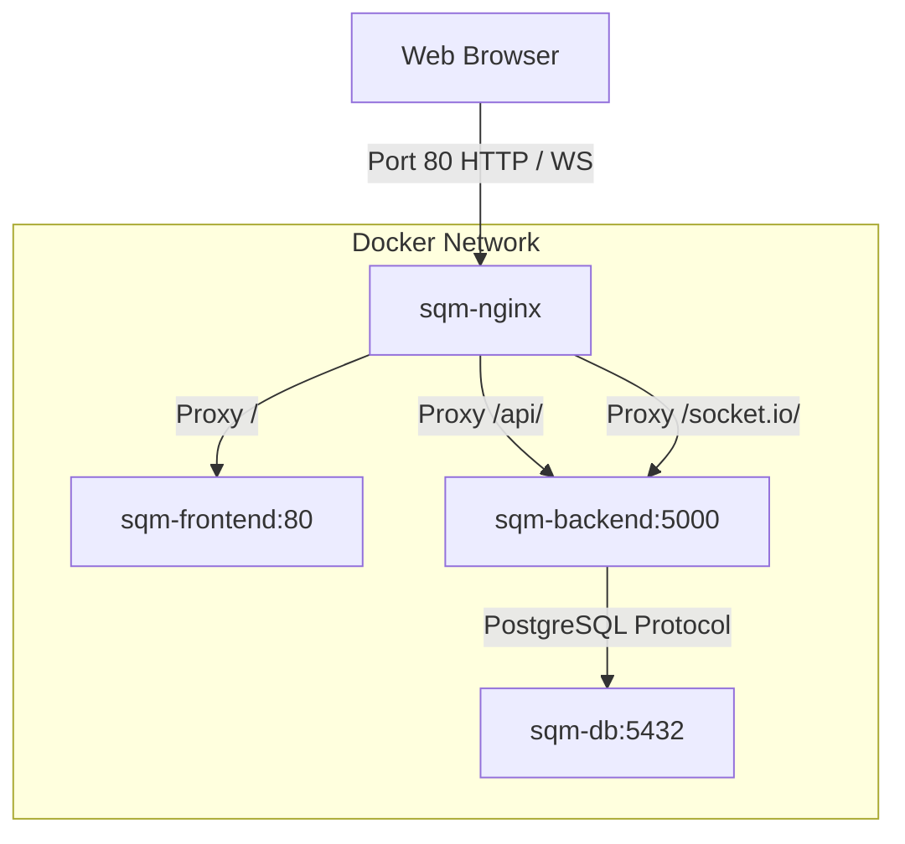

# Smart Queue Manager

> **NOTE**: The auto-retraining pipeline runs in-process. Do not run more than 1 replica without refactoring the training job to a separate process.

Smart Queue Manager is an AI-powered queue and token management application designed to optimize counter operations. It uses a machine learning classifier to detect required services from user messages, estimates wait times via regression models, and dynamically routes customers to counters utilizing a Reinforcement Learning (Q-learning) optimizer. The system is designed with a production-grade factory pattern, structured JSON logging to stdout, strict Marshmallow schema input validation, rate limiting, and standard global error handlers.

## Local Access
- **Frontend App:** [http://localhost:5173](http://localhost:5173)
- **Backend API:** [http://localhost:5000](http://localhost:5000)


## Tech Stack
- **Backend**: Python Flask 3.1, Flask-SQLAlchemy 3.1, Flask-JWT-Extended 4.7, Flask-SocketIO 5.6, Flask-Limiter 3.8, Marshmallow 3.21
- **Database**: PostgreSQL (Production) / SQLite (Development)
- **AI/ML**: Scikit-Learn 1.8 (Random Forest / Logistic Regression), Pandas 3.0
- **Frontend**: React 19, Vite 7, Axios 1.13, Socket.io Client 4.8

## Prerequisites
- Python 3.11+
- Node.js 18+
- PostgreSQL 15+ (optional for production database)

## Getting Started

### Step-by-Step Commands to Run Backend on a Fresh Machine:
```bash
# Clone the repository and navigate to the project directory
git clone <repository-url>
cd smart-queue-manager

# Navigate to backend and copy environment file
cd backend
cp .env.example .env
# Edit .env with your local secret keys and configuration values

# Set up virtual environment and install dependencies
python -m venv venv
.\venv\Scripts\activate # On Unix: source venv/bin/activate
pip install -r requirements.txt

# Start the Flask development server
python run.py
```

### Step-by-Step Commands to Run Frontend:
```bash
# Navigate to frontend and copy environment file
cd ../frontend
cp .env.example .env
# Edit .env to adjust backend API/Socket URLs if needed

# Install Node packages and start dev server
npm install
npm run dev
```

## Environment Variables

### Backend Variables (`backend/.env`)
| Variable | Description | Example |
|---|---|---|
| `FLASK_ENV` | Application environment (development, production) | `development` |
| `DEBUG` | Toggle Flask debugging | `true` |
| `PORT` | Local server port | `5000` |
| `SECRET_KEY` | Flask session secret key | `super-secret-key-123` |
| `JWT_SECRET_KEY` | JWT signing secret key | `jwt-secret-key-456` |
| `DATABASE_URL` | SQLAlchemy connection string | `sqlite:///queue.db` |
| `DB_POOL_SIZE` | Database pool size (Postgres only) | `10` |
| `DB_MAX_OVERFLOW` | Maximum database connection overflow | `20` |
| `ALLOWED_ORIGINS` | Permitted CORS origins (comma-separated) | `http://localhost:5173,http://localhost:3000` |
| `LOG_LEVEL` | Minimum logging level threshold | `INFO` |

### Frontend Variables (`frontend/.env`)
| Variable | Description | Example |
|---|---|---|
| `VITE_API_URL` | Backend server URL | `http://localhost:5000` |
| `VITE_SOCKET_URL` | Backend WebSockets URL | `http://localhost:5000` |

## API Endpoints
| Method | Route | Description | Auth |
|---|---|---|---|
| GET | `/health` | Application health and database monitoring | No |
| GET | `/health/model` | ML model status and version | No |
| GET | `/health/ws` | WebSocket active connections count | No |
| POST | `/auth/register` | Register new user account | No |
| POST | `/auth/login` | Authenticate user and issue JWT | No |
| POST | `/counter/add` | Create a new counter blueprint | Yes (Admin) |
| GET | `/counter/all` | List all registered counters | No |
| DELETE | `/counter/delete/<id>` | Remove counter blueprint | Yes (Admin) |
| POST | `/queue/ai-detect` | Predict service type from textual problem description | No |
| POST | `/queue/new` | Request a new queue token | No |
| GET | `/queue/counter/<id>/next` | Fetch next waiting token for counter | No |
| GET | `/queue/counter/<id>/tokens` | Fetch all waiting tokens for counter | No |
| GET | `/queue/board/live` | Retrieve current status of all counters | No |
| POST | `/queue/start/<id>` | Mark a queue token as serving | No |
| POST | `/queue/finish/<id>` | Mark a queue token as completed | No |
| GET | `/queue/current/<id>` | Retrieve active serving token for counter | No |


## Running Tests
Ensure development dependencies are installed and run the Pytest suite:
```bash
# Inside smart-queue-manager/backend
pip install -r requirements-dev.txt
pytest tests/ -v
```

## Production Architecture & Deployment

This project uses a production-ready DevOps architecture managed via Docker Compose and Nginx.

### Architecture Diagram


### Reverse Proxy Explanation
An **Nginx reverse proxy** container acts as the single gateway for all client traffic, listening on port `80` (public HTTP port).
1. **Frontend (`/`)**: Static React application assets served via another lightweight Nginx server inside `sqm-frontend`.
2. **Backend API (`/api/`)**: API requests routed to Flask. The `/api/` prefix is stripped during proxying (`proxy_pass http://backend:5000/;` with a trailing slash) so that Flask receives paths starting directly with `/queue`, `/auth`, etc.
3. **WebSockets (`/socket.io/`)**: Real-time event updates handled via Socket.IO. Nginx upgrades connections to standard WebSocket protocol with custom headers:
   ```nginx
   proxy_http_version 1.1;
   proxy_set_header Upgrade $http_upgrade;
   proxy_set_header Connection "Upgrade";
   ```
4. **Internal Security**: Both frontend and backend containers do not expose public ports (port mappings like `3000:80` and `5000:5000` are removed). Instead, they are exposed internally using `expose` within Docker's isolated network, meaning only Nginx can route traffic to them.

### AWS EC2 Deployment Steps

To deploy this setup on an AWS EC2 instance:

1. **Launch EC2 Instance:**
   - Launch an Ubuntu Server 22.04 LTS or Amazon Linux 2023 instance on EC2.
   - Configure Security Groups to allow public inbound traffic on **Port 80 (HTTP)** and **Port 22 (SSH)**.

2. **Install Docker & Docker Compose:**
   - On Ubuntu, run:
     ```bash
     sudo apt update && sudo apt install -y docker.io docker-compose-v2
     sudo usermod -aG docker $USER
     # Log out and log back in to apply group permissions
     ```

3. **Clone the Repository:**
   - Clone your project and navigate to the root directory:
     ```bash
     git clone <repository-url>
     cd smart-queue-manager
     ```

4. **Prepare Environment Files:**
   - Create the backend environment file:
     ```bash
     cp backend/.env.example backend/.env
     # Edit backend/.env using nano/vim to set production configurations
     # e.g., secret keys, Postgres DB credentials, etc.
     ```

5. **Start Deployment:**
   - Run the following Docker Compose command to build and launch all containers in detached mode:
     ```bash
     docker compose up -d --build
     ```

6. **Verify Status:**
   - View running containers and logs:
     ```bash
     docker compose ps
     docker compose logs sqm-nginx
     ```
   - Open your browser and navigate to `http://<YOUR_EC2_PUBLIC_IP>` to access the application.

## Project Structure

```
smart-queue-manager/
├── backend/
│   ├── app/
│   │   ├── __init__.py           ← App factory pattern setup
│   │   ├── config.py             ← Environment config mapping
│   │   ├── extensions.py         ← Third-party extensions initialization
│   │   ├── ai/                   ← ML models & algorithm scripts
│   │   │   ├── __init__.py
│   │   │   ├── build_dataset.py
│   │   │   ├── rl_optimizer.py
│   │   │   ├── service_classifier.py
│   │   │   ├── wait_predictor.py
│   │   │   └── retrain_model.py
│   │   ├── middleware/           ← Request validation & auth hooks
│   │   │   ├── __init__.py
│   │   │   └── auth.py
│   │   ├── models/               ← Database SQLAlchemy models
│   │   │   ├── __init__.py
│   │   │   ├── counter.py
│   │   │   ├── token.py
│   │   │   └── user.py
│   │   ├── routes/               ← Controller blueprints
│   │   │   ├── __init__.py
│   │   │   ├── auth.py
│   │   │   ├── counter.py
│   │   │   ├── queue.py
│   │   │   └── health.py
│   │   ├── schemas/              ← Marshmallow validation schemas
│   │   │   ├── __init__.py
│   │   │   ├── auth.py
│   │   │   ├── counter.py
│   │   │   └── queue.py
│   │   ├── services/             ← Encapsulated business logic layer
│   │   │   ├── __init__.py
│   │   │   ├── auth_service.py
│   │   │   ├── counter_service.py
│   │   │   ├── queue_service.py
│   │   │   └── ai_service.py
│   │   └── utils/                ← Custom utility functions
│   │       ├── __init__.py
│   │       └── logging.py
│   ├── tests/                    ← Integration and unit test suites
│   │   ├── conftest.py
│   │   ├── test_auth.py
│   │   ├── test_health.py
│   │   └── test_queue.py
│   ├── config.py
│   ├── requirements.txt
│   ├── requirements-dev.txt
│   ├── run.py
│   └── .env.example
├── frontend/
│   ├── src/
│   │   ├── components/           ← Reusable UI elements
│   │   ├── constants/
│   │   ├── pages/                ← Routing page views
│   │   ├── services/             ← Axios and WebSocket connections
│   │   ├── App.css
│   │   ├── App.jsx
│   │   ├── index.css
│   │   └── main.jsx
│   ├── package.json
│   └── .env.example
├── .gitignore
└── README.md
```
